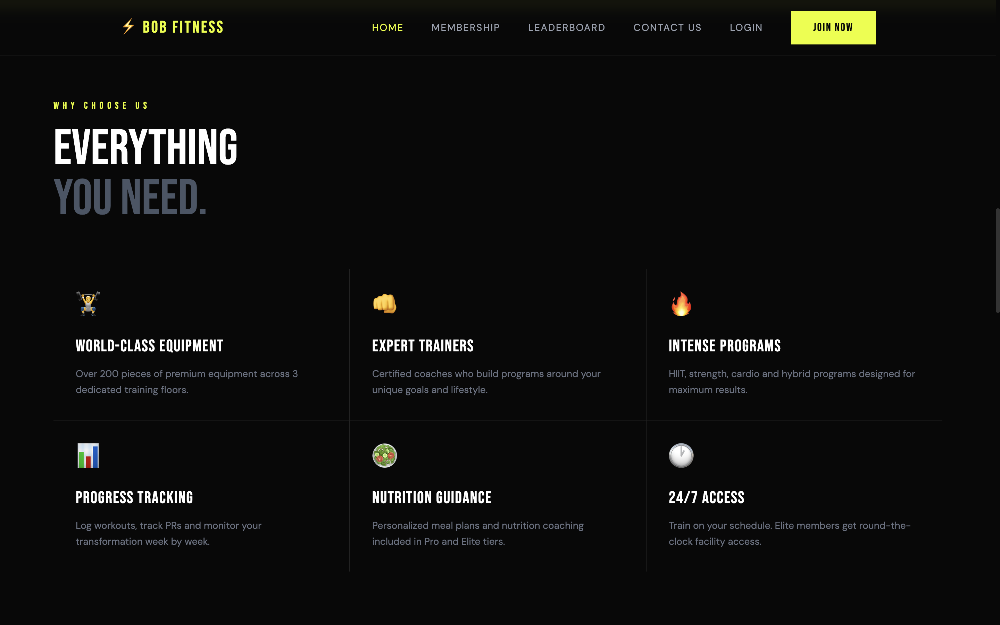
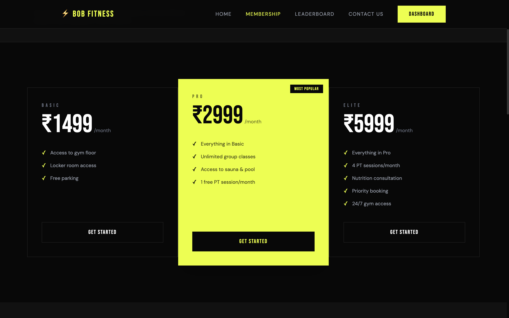
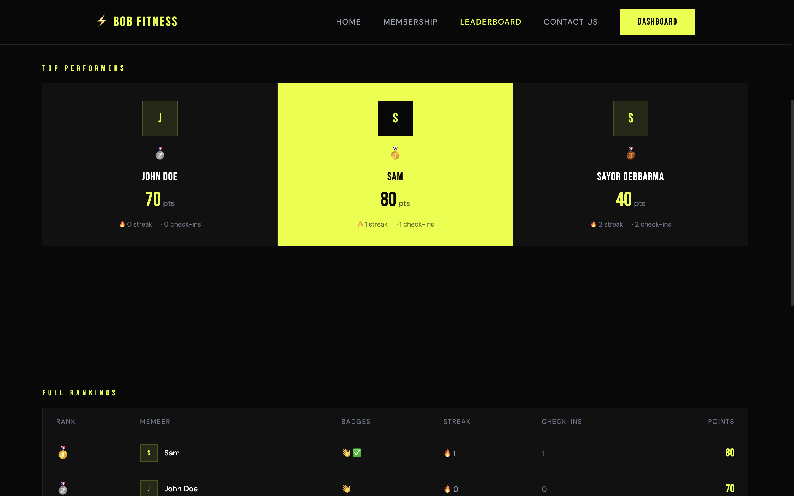
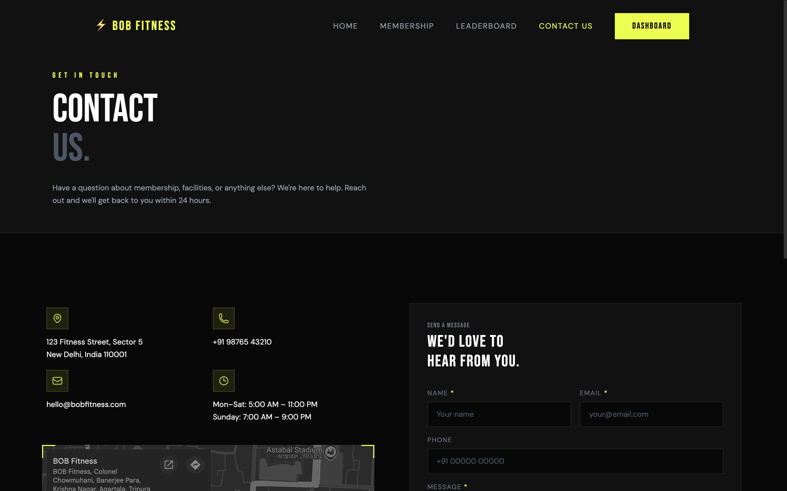
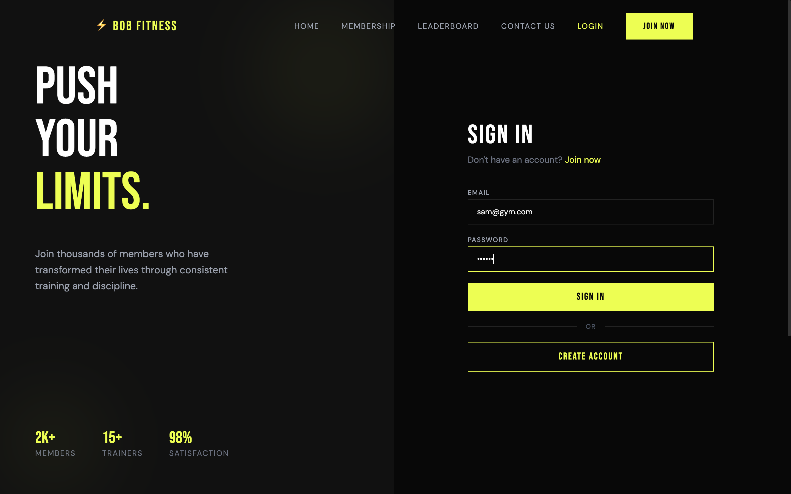
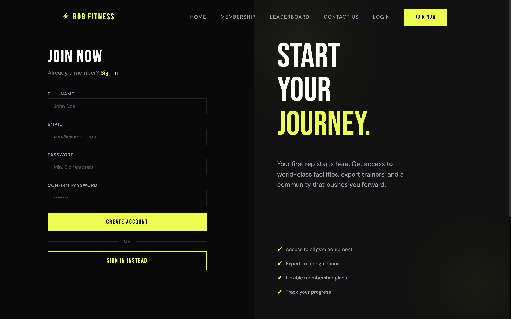
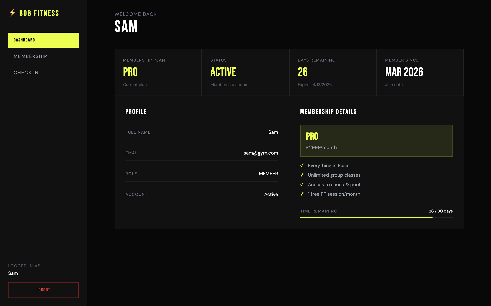
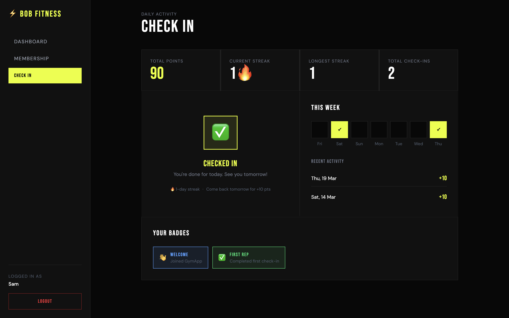
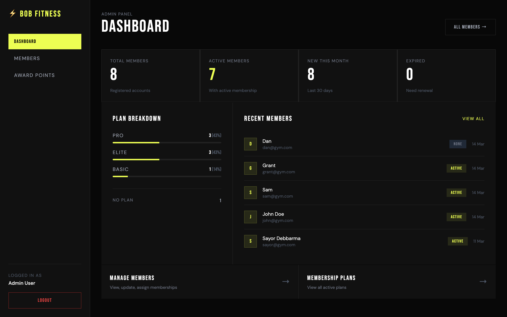
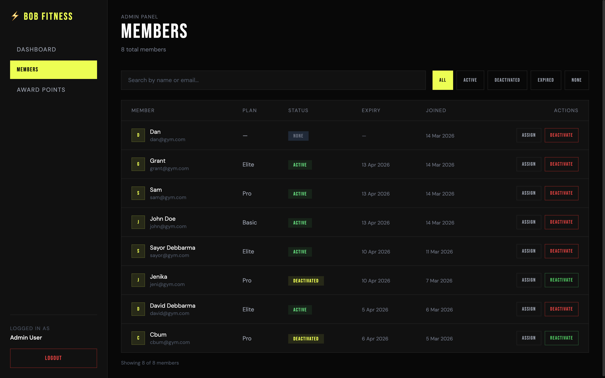

# ⚡ Bob Fitness — Premium Gym Management Platform

A full-stack gym management platform built with the MERN stack. Features membership management, daily check-ins, gamification with streaks and badges, a public leaderboard, and a dark editorial UI with GSAP animations and Lenis smooth scroll.

**Live Demo:** [bobfitness.vercel.app](https://bobfitness.vercel.app)

---

## Screenshots

### Home




### Public Pages




### Auth



### Member



### Admin



---

## Features

**Member**
- JWT authentication with HTTP-only cookies
- Membership plan subscription using Razorpay (Basic / Pro / Elite)
- Daily gym check-ins with streak tracking
- Points system, badges, and public leaderboard
- Member dashboard with membership status and expiry tracking

**Admin**
- Admin dashboard with live stats and plan breakdown
- Member management — search, filter, assign plans, deactivate
- Manually award points to members _(coming soon)_

**General**
- Dark editorial UI with electric yellow-green accent
- GSAP scroll animations + Lenis smooth scroll
- Fully responsive — mobile drawer navigation
- Role-based access control (Admin / Member)

---

## Tech Stack

| Layer | Tech |
|---|---|
| Frontend | React 19 (Vite), Tailwind CSS v4, GSAP, Lenis |
| Backend | Node.js, Express.js |
| Database | MongoDB Atlas + Mongoose |
| Auth | JWT + HTTP-only cookies |
| Deployment | Vercel (frontend) + Render (backend) |

---

## Project Structure
```
gym-website/
├── client/                  # React frontend (Vite)
│   ├── src/
│   │   ├── components/      # Shared UI components
│   │   ├── context/         # Auth context
│   │   ├── hooks/           # useLenis
│   │   ├── layouts/         # MainLayout, DashboardLayout
│   │   ├── pages/           # All pages
│   │   └── utils/           # Axios instance, badge config
│   └── public/
│       └── videos/          # Local gym video assets
│
└── server/                  # Node + Express backend
    ├── config/              # MongoDB connection
    ├── controllers/         # Route logic
    ├── middleware/          # Auth, error handler
    ├── models/              # Mongoose schemas
    ├── routes/              # Express routers
    └── utils/               # JWT, points helpers
```

---

## Local Setup

### Prerequisites
- Node.js v18+
- MongoDB Atlas account
- Git

### 1. Clone the repo
```bash
git clone https://github.com/sayordebbarma/gym-website.git
cd gym-website
```

### 2. Setup the backend
```bash
cd server
npm install
```

Create `server/.env`:
```env
PORT=8000
NODE_ENV=development
MONGO_URI=your_mongodb_atlas_uri
JWT_SECRET=your_jwt_secret_key
JWT_EXPIRE=7d
CLIENT_URL=http://localhost:5173
```

Seed the database with membership plans:
```bash
npm run seed
```

Start the server:
```bash
npm run dev
```

### 3. Setup the frontend
```bash
cd ../client
npm install
```

Create `client/.env`:
```env
VITE_API_URL=http://localhost:8000/api/v1
```

Start the client:
```bash
npm run dev
```

### 4. Open in browser
```
http://localhost:5173
```

---

## API Routes

| Method | Endpoint | Access |
|---|---|---|
| POST | `/api/v1/auth/register` | Public |
| POST | `/api/v1/auth/login` | Public |
| POST | `/api/v1/auth/logout` | Public |
| GET | `/api/v1/auth/me` | Member |
| GET | `/api/v1/memberships` | Public |
| POST | `/api/v1/memberships/subscribe/:id` | Member |
| GET | `/api/v1/gamification/leaderboard` | Public |
| POST | `/api/v1/gamification/checkin` | Member |
| GET | `/api/v1/gamification/my-stats` | Member |
| GET | `/api/v1/admin/dashboard` | Admin |
| GET | `/api/v1/admin/members` | Admin |
| POST | `/api/v1/admin/members/:id/assign-membership` | Admin |
| POST | `/api/v1/gamification/award-points` | Admin |

---

## Deployment

| Service | Platform |
|---|---|
| Frontend | [Vercel](https://vercel.com) |
| Backend | [Render](https://render.com) |
| Database | [MongoDB Atlas](https://mongodb.com/atlas) |

---

## Author

**Sayor Debbarma**  
Full Stack Developer — MERN + Next.js 
[GitHub](https://github.com/sayordebbarma) · [LinkedIn](https://linkedin.com/in/sayordebbarma)

---

## License

MIT — free to use for personal and commercial projects.